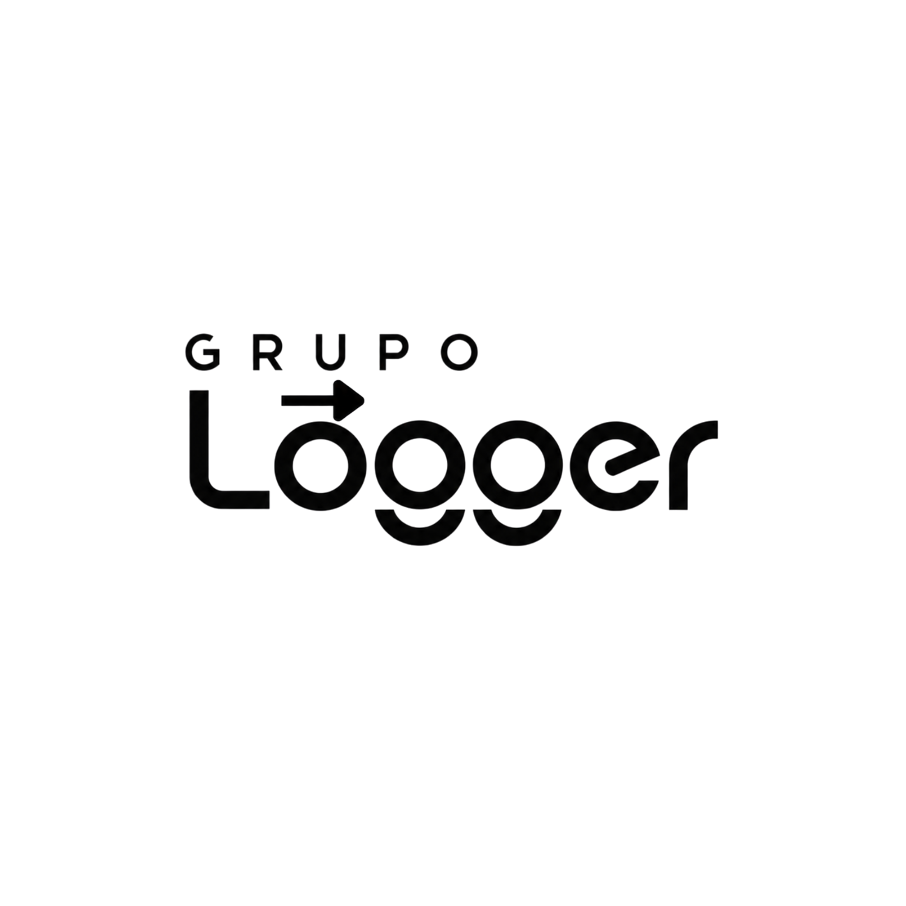
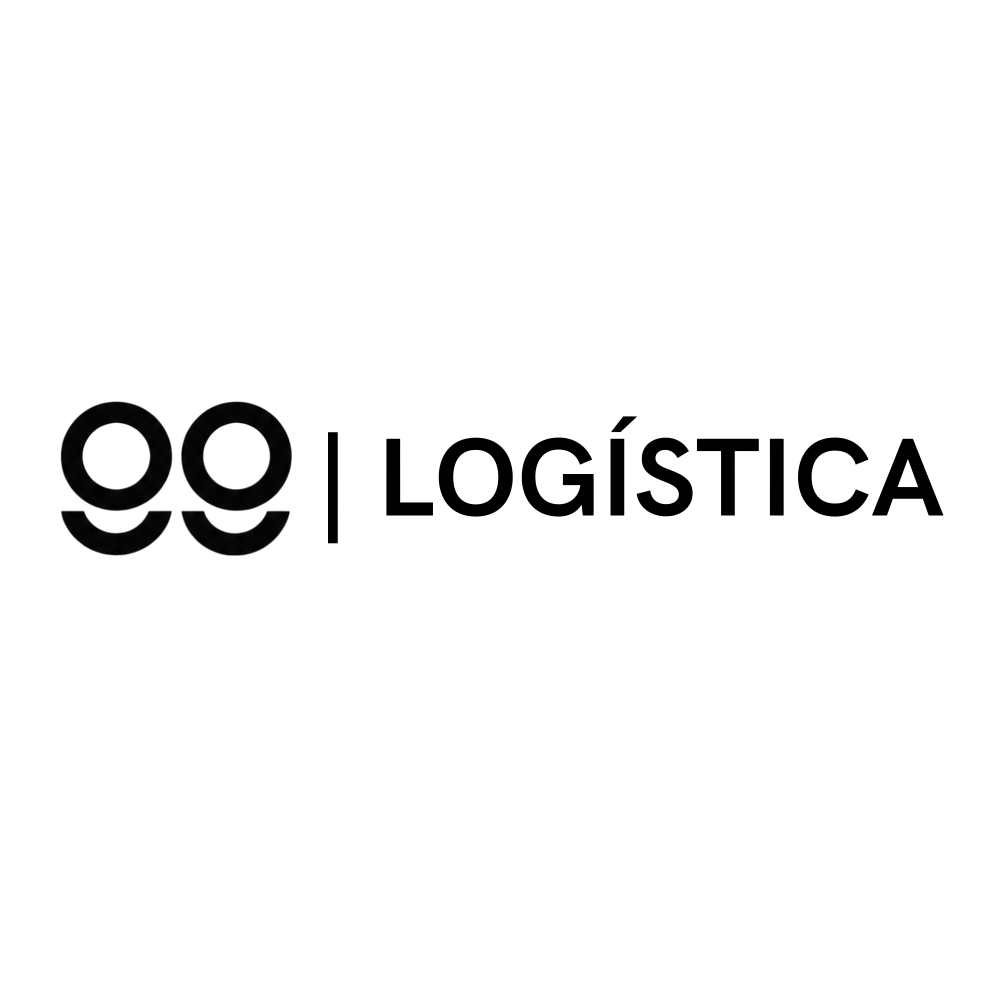
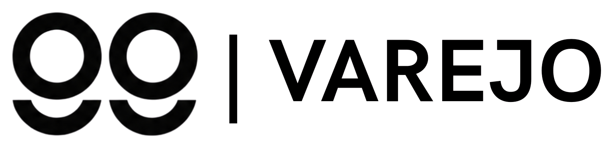
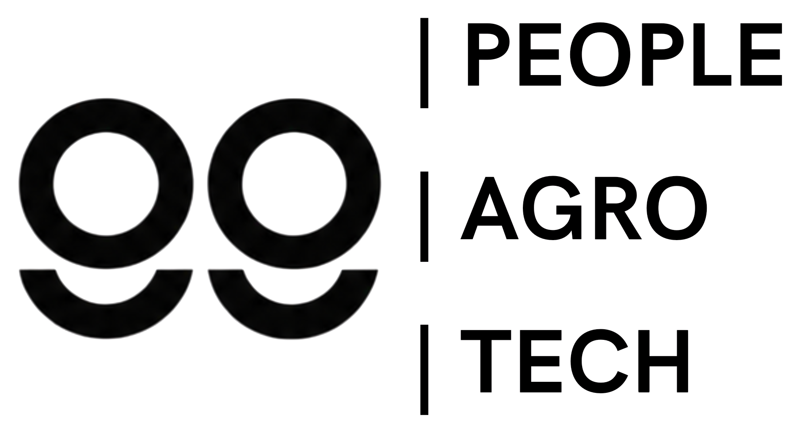

  

  <h1>Movemos o que importa.</h1>

  

    Um grupo brasileiro que conecta operação, gestão e tecnologia 
    para transformar desafios reais em movimento.
  

  

    <a href="mailto:contato@grupologger.com.br"><strong>Fale com o Grupo Logger</strong></a>
  

---

## Um grupo. Diferentes caminhos.

O **Grupo Logger** nasceu para construir soluções próximas da realidade de cada cliente. Reunimos diferentes áreas de atuação sob uma mesma direção, combinando visão administrativa, capacidade técnica e atenção à operação.

Partimos de uma ideia simples: entender primeiro, construir depois. Cada empresa tem sua própria rotina, seus desafios e seu jeito de trabalhar. Por isso, buscamos soluções coerentes com cada contexto, capazes de gerar valor na prática.

## Nossas frentes

<table>
  <tr>
    <td width="33%" valign="top">
      
      <h3>Logística</h3>
      
Precisão, escala e inteligência para levar cada coisa ao seu destino.

    </td>
    <td width="33%" valign="top">
      
      <h3>Varejo</h3>
      
Tecnologia para conectar vendas, gestão e atendimento à rotina do negócio.

    </td>
    <td width="33%" valign="top">
      
      <h3>Techsolutions</h3>
      
Software sob medida, desenvolvido conforme as necessidades e a área de atuação de cada cliente.

    </td>
  </tr>
</table>

## Tecnologia feita para a empresa real

Cada problema pede uma resposta construída a partir do seu contexto. Na **Techsolutions**, analisamos a necessidade, a rotina e os objetivos de cada negócio antes de desenvolver.

Criamos soluções digitais sob medida para apoiar processos, organizar informações, conectar áreas e abrir novas possibilidades. O software acompanha a empresa, em vez de obrigar a empresa a se adaptar a um produto genérico.

## Administração e tecnologia na mesma direção

O Grupo Logger é construído por duas formações complementares. Essa união permite observar cada projeto por diferentes ângulos: viabilidade, organização, operação, dados e desenvolvimento.

<table>
  <tr>
    <td width="50%" valign="top">
      <h3>Carlos Romanow</h3>
      <strong>Tecnologia da Informação</strong>
      
Experiência no setor de dados e formação atual em Tecnologia da Informação pela Universidade Federal de Mato Grosso do Sul.

    </td>
    <td width="50%" valign="top">
      <h3>Bruno Camargo</h3>
      <strong>Administração</strong>
      
Formação técnica em Administração pela ETEC e graduação em andamento pela Faculdade Hub.

    </td>
  </tr>
</table>

Essa combinação aproxima estratégia e execução. Administração e tecnologia participam da mesma conversa desde o início, ajudando a construir soluções que façam sentido tanto no planejamento quanto no dia a dia.

## Nosso jeito de fazer

- **Proximidade** para compreender a realidade de cada cliente;
- **Clareza** para transformar necessidades em caminhos possíveis;
- **Praticidade** para criar soluções que funcionem na rotina;
- **Tecnologia** aplicada com propósito e contexto;
- **Movimento** para tirar ideias do papel e levá-las adiante.

---

  <h2>Tem um desafio?</h2>
  
Conte o que você está construindo. A gente encontra o melhor caminho juntos.

  

    <a href="mailto:contato@grupologger.com.br"><strong>contato@grupologger.com.br</strong></a>
  

   
  <strong>Grupo Logger · Movemos o que importa.</strong>

